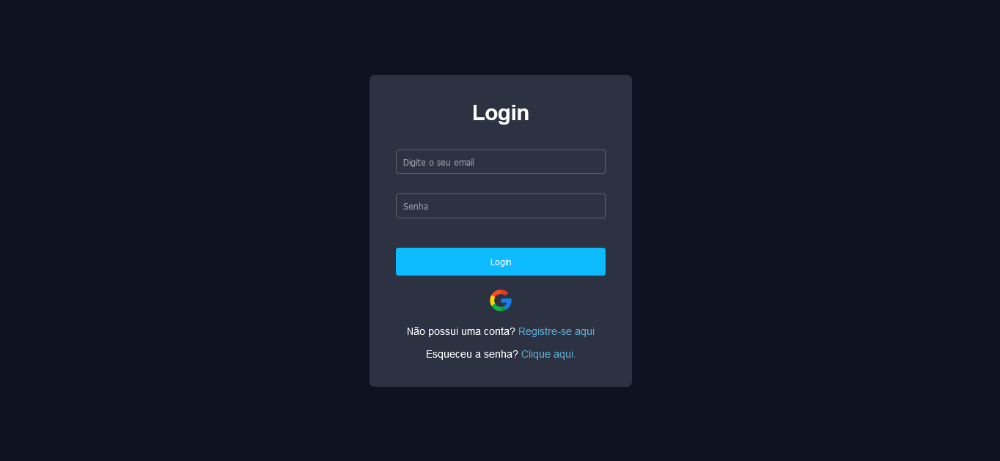
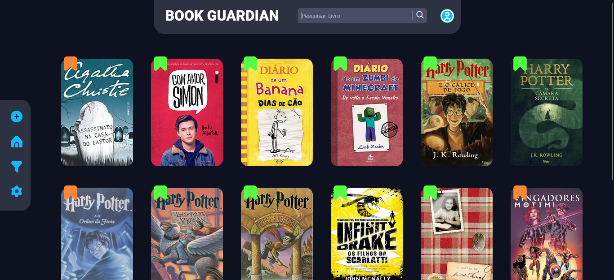
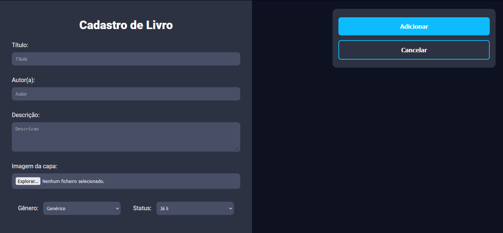
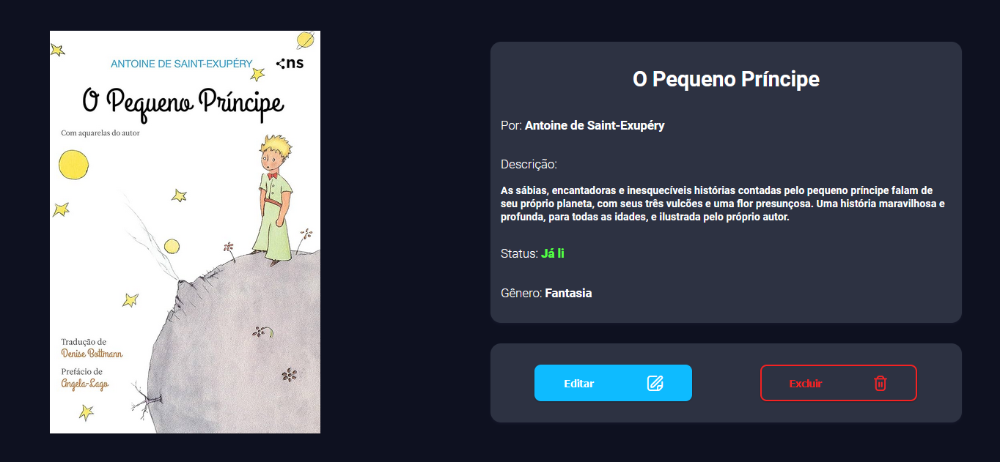

# Bem-vindo à organização do Book Guardian! 

### Nossa missão é ajudar você a organizar e registrar os livros que já leu ou que deseja ler.

## Integrantes 
- [Camile Andrade](https://www.github.com/andra-sun)
- [Fernando Teixeira](https://www.github.com/nadox00)
- [Luiz Henrique](https://www.github.com/LuyysHenriqueKuromi)
- [Marcos Vilas](https://www.github.com/VilasBoass)
- [Wendel alves](https://www.github.com/wendellast)

## Tecnologias Utilizadas

## Funcionalidades

Em nosso [site](https://book-guardian-production.up.railway.app/), oferecemos uma experiência completa para gerenciamento de livros. Aqui estão as principais funcionalidades disponíveis:

- **Criação de Conta**: Os usuários podem facilmente criar uma conta pessoal para começar a gerenciar seus livros.
- **Cadastro de Livros**: Adicione novos livros à sua coleção, incluindo todas as informações relevantes.
- **Edição de Livros**: Edite as informações dos livros cadastrados conforme necessário.
- **Exclusão de Livros**: Remova livros que não deseja mais manter na sua coleção.
- **Visualização Detalhada**: Visualize todas as informações de um livro específico clicando na capa do livro.
- **Tela Inicial**: Veja todos os livros adicionados à sua conta na tela inicial. Os livros são marcados para fácil identificação:
  - **Bandeira Verde**: Indica que o livro já foi lido.
  - **Bandeira Laranja**: Indica que o livro ainda não foi lido.
- **Filtragem e Pesquisa**: Encontre rapidamente livros adicionados utilizando várias opções de filtragem:
  - **Nome do Livro**
  - **Nome do Autor**
  - **Gênero do Livro**
  - **Status de Leitura**
- **Modo Escuro/Claro**: Altere a aparência do site para modo escuro ou claro nas configurações, conforme sua preferência.
- **Personalização de Cores**: Escolha entre azul e rosa para as cores principais do site, proporcionando uma experiência visual mais agradável.

Com essas funcionalidades, nosso site oferece uma experiência intuitiva e personalizada para você gerenciar e explorar sua coleção de livros.

## Screenshots
| Landing page |
| --- |
|  |

 

| Login |
| --- |
|  |

 

| Tela Principal |
| --- |
|  |

 

| Tela de Cadastro do Livro |
| --- |
|  |

 

| Tela de Informações do Livro |
| --- |
|  |
